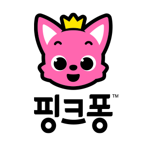
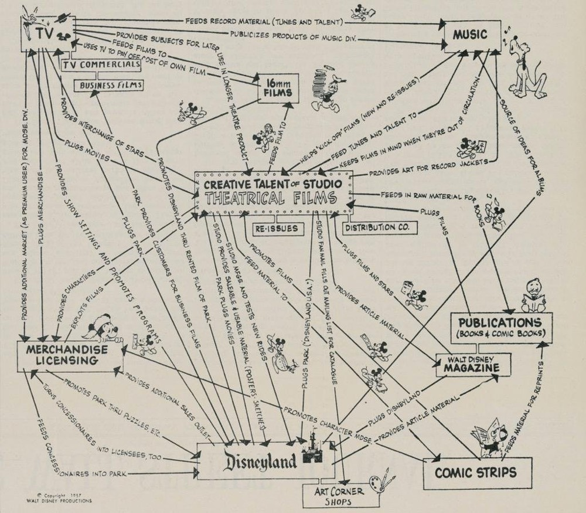

# 핑크퐁의 이야기

“과거의 내가 현재의 나를 만든다.”

### connecting dots

과거에 했던 일이 내가하는 일에 조금씩 보태어 지금의 내가 하는일을 만든다고 생각!

학교에서 미학 전공 → 넥슨 게임 디자이너, kog Studio에서는 글로벌 사업관련 업무를 맡음. → 교육 컨텐츠 사업 → 핑크퐁 탄생!

### 게임회사를 다니다가 어떻게 창업을 하게 되셨나요?

2010년도 당시, 아이폰이 한국에 들어와서 한참 알려지기 시작했습니다. 그때 당시

“아이폰을 바탕으로 사업을 하면 어떨까?” 라는 생각을 기반으로 아이폰에서 아이들이 학습을 할 수 있는 아이템으로 사업을 하게되었습니다.

### 창업초장기 지옥구간

2-3년간 : 스마트 스터디 (스마트 폰에서 공부를 할 수 있는)

→ 실패함. **왜 실패했을까?** : 모든 사람이 저희와 같다고 생각함.

누구나 아이폰을 쓰고, 아이패드를 사용하고, 아이들에게 스마트폰을 주고 사용하게끔 하는 사람들.

하지만 현실은, 엄마 입장에서 아이들에게 스마트폰을 10-15분을 주기를 선호하지 않음.

→ 이러한것을 고려하지 않고, 우리가 더 나은 기술로 제공해주면 사람들이 따라올거야! 라고 생각함.

이때알게된 것.

### “아무리 내 기술이 좋아도 소비자의 행동패턴을 바꾸지 못한다.”

→ 스위칭 코스트(소비자의 기존 행동을 바꾸는데 드는 비용)가 생각보다 비싸다.

### 소비자를 이해하기 위해 무엇을해야할까?

- 인터뷰 : “그거 너무 좋다~ “
  - 사회적인 분위기에 어쩔 수 없이, 긍정적인 피드백이 다수
  - 돈을 내지 않은 사람들의 이야기는 가려서 들어야한다.
  - 정말 우리 아이템에 돈을 낼 사람들의 이야기를 들어야한다.

→ 서점에서 가장 잘 팔리는 것을 디지털로 만들자!

→ 스티커북! : 엄마들 입장에서도 좋고(집에 다 붙일 스티커를 휴대폰 화면에 붙이니까), 아이들에게도 스티커외에 동적인 이미지, 소리를 제공하며 흥미를 돋구어 줄 수 있음.

### 앱에서 스티커북 : 잘 되지 않음.

왜 ? : 아이들은 스티커 붙이기 외에 엄마의 잔소리와 친구들의 반응 등 사회적인 인터렉션을 더 재미있어 함.

→ 유저의 숨은 니즈를 잘 관찰해야한다!

그리하여 만들어지게된,

### <핑크퐁 컴퍼니>

아이들용 애니메이션 뮤직비디오를 만들어서 사업을 해보자

- 클래식과 트랜드의 조합(잊혀졌지만 의미있는 동요를 리메이크)

학습 → 컨텐츠를 만드는, 아이들을 대상으로 뮤직비디오를 만드는 회사

### 큰 반응을 얻게된 “베이비 샥”

과거에 했던것들이 지금의 나를 만든다.

다채로운 것을 극대화하는것 : create : 좋은 컨텐츠를 만드는 가장 기본적인 기술

**넥슨에서 게임을 디자인하며 본인이 가장 잘했던은?**

→ 켜질때 걸리는 시간에 영상을 집어넣는 : 디즈니, 유니버셜 영상에서 따옴

- 회사의 이미지를 주고, 지금부터는 **다른 현실이 열린다는것을 보여줌.**
- 새로운 재미잇는 동요가 시작되는구나~
- 컬러를 이용해서 아이들을 매료함.
- 컬러, 느낌, 기하학적인 형상
- 나의 핵심가치2,3가지를 초기부터 브랜딩해야 함.

### 회사의 이름은 왜 핑크퐁이 되었나?

회사의 주요 고객 : 엄마, 아이들

엄마들에게 잘 다가갈 수 있는 컬러, 핫핑크

학습컨텐츠에 맞는 → 스마트한 동물 : 교활하지만 영리한 여우

통통튀는 fun 한 느낌 핑크퐁

(외국 사람이 부를때는 생각해보지 못함. → 다른나라 말일때 어떤 느낌을 주는지도 생각해보길)

### 아이들도 어른들과 비슷하다(힘이센지, 예쁜지, 누가날 좋아하는지에 관심이 많다.)

기존의 아이들의 만화, 이야기에서는 동물 중 가장 귀엽고 예쁜것이 주인공

강한 동물을 주인공을 해보고 싶었다. 사자, 상어 → 아기 상어를 고르게 됨

아이들외에도 사회적으로 **동물, 미인, 아이**는 사람의 눈을 가장 끎.

기존의 것을 조금씩 바꾸는 것이 유리함.(기존의 시장, 스위칭 코스트) 동시에 너무나 뻔한것은 지겨움.

- 새로운것과 익숙한것의 중간정도 되는 그러한것.
- 익숙해보이는 어떤것을 사용해보니, 조금 다른 아웃풋을 주는 그런 product를 창작하고자 함.

적용) 베이비샥도 미국의 클래식한 캠프송이었음.

→ kpop스타일, 클래식함을 더해서 만듬. 아는사람도 있는데 잊혀진것을 요즘 방식으로 바꿈.

영원한 주제인 가족을 다뤘던것이 베이비샥 인기의 요인이라고 생각함.

또한 누구나 따라하기 쉬운 춤

### Different

어떻게 하면 다르게 할까?

개발기술의 트렌드를 익혀야한다고 생각함.

10년전의 아이폰처럼…

아이폰 덕에 우버, 카카오등 여러 컴퍼니가 생김.

어떻게 chat gpt 로 고객의 만족을 줄 수 있을까?

코비드 : 손씻기 컨텐츠

---

### times 100 most influence company

### 핑크퐁의 성공이후,

### 그러면 그다음은 뭐지? 어떻게하면 그다음 후속작을 만들 수 있을까?

어떤생각을 가지고, 어떻게 행동하는지?, 핑크퐁의 3가지 Strategy

- 팬덤을 가지기 : 쉽지 않음. 핑크퐁을 보았던 아이들이 성장하면 -> 핑크퐁은 애들이 보는거지! -> 지속적 관계는 한계임
- variation : 다양한 캐릭터로 다양한 버전의 영상을 만듬. (collaboration)
  - 기존의 베이비샥을 모르는 사람에게 퍼트리고 싶었음. 윈윈하는 상황을 이용해 마케팅 함.
  - 게임안에서의 베이비 샥, 예상치 못한 캐릭터와 콜라보
- 핑크퐁(유튜브)의 큰장점 : 빠르게 퍼짐, 단점 : 지속성이 떨어짐.
  - 같이가려면 스토리가 중요 : 친구들과 라이벌과 어떻게 살아가는지의 내용 추가
  - 베이비샥 극장용 영화
- expansion
  - 50%컨텐츠, 나머지는 캐릭터 라이센스
  - 디즈니에서 1960년부터 시작한것. 극장과 디즈니랜드
    - 디즈니 비즈니스 모델 : 미키를 영원히 지속하기위한 전략
  - 삶속에 베이비샥과 함께하도록 : baby shark offline
- explore
  - 베이비샥 이외의 컨텐트를 어떻게 만들까? → bebefinn
  - 아이들 : 동물을 좋아하는시기, 사람을 좋아하는 시기가 있음.
    - 사람의 컨텐츠로 올바른 행동을 배우도록 할 수 있음.
  - 같은 타깃의 다른 취향.
  - sealook
    - 바다에 사는 동물들. 논버멀 형태의 컨텐츠
    - 10대 후반 30대를 타깃
  - 웹툰 준비
- 디즈니를 목표 bob iger
  - 컨텐츠, 소비자 상품, 테마파크
  - 또다른 경험을 어떻게 줄 수 있을까?
  - 컨텐츠를 배포용으로 많이 사용함.
  - ai 기술을 이용해야겠다고 생각, 준비중. ai를 적용한 컨텐츠를 준비중
- 각각의 사람이 회사의 주인공 → 개인별 명함을 만들어줌.

1. 소비자 이해
2. 개발변화에 민감
3. 귀엽고, 재밌는, 흥미있는 캐릭터
4. 개발 단계단계별로 고객 확보.

ryan@pinkfong.com

ryan seungkyu lee

### 스타트업이 협업할 회사를 고른다면..

제3자가 알만한 회사와 일하는것이 좋음

예시 ) 핑크퐁 : lg생활건강과 함께함. → 다른 회사도 (lg가 썻으니까 )믿음을 가짐

→ **나를 보장해줄 수 있는 회사를 찾는것이 중요함.**

---

