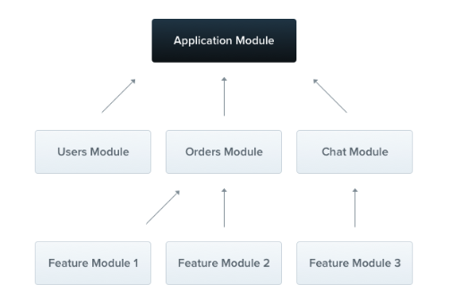

# 2023.12.12 - module 과 provider

**Nest could not find ReservationSupportService element 에러**

stackoverflow 에서는 strict: false 옵션추가 또는 모듈을 제대로 Import 했는지 확인하라고 한다.
어제의 common error에서도 provider 에 대한 내용이 해결책으로 나왔었다.

nestjs 는 모듈을 기반으로 동작하는데 import, module, provider, export 에 대한 내용이 제대로 적립되지 않은것같으니, 한번 더 짚어보자.

module : 코드간 응집도를 높이기 위해 특정한 기준으로 쪼개진 코드 덩어리. 애플리케이션이 제대로 실행되기 위해서는 각각의 모듈을 모아 하나의 루트 모듈을 구성해야한다.



모듈은 @Module()데코레이터를 사용해서 만들 수 있다. 데코레이터는 nest 가 애플리케이션 구조를 구성하는 메타데이터를 제공한다.

@Module()데코레이터는 4가지 속성을 갖는다. : imports, exports, controllers, providers

```typescript
@Module({
	imports: [StudyModule],
	controllers: [SubController, AppController, StudyController]
	providers: [AppService, StudyService, ChildService, TestService]
})
export class AppModule {}
```

imports : import 형태는 반드시 모듈 형태이어야한다.
provider : service, repository 등 구현부이다. provider를 활용해 의존성 주입을 할 수 있다.

provider 배열에 넣기 전, 사용하려는 클래스에 @injectable()데코레이터를 사용해야한다.
의존성을 주입하려는 대상에 @injectable()을 사용하고 provider 로 의존성 주입을 해주면 되는것!

의존성주입 : 외부에서 객체를 전달받는것이 아니라, 추상화된 객체를 외부에서 받는것.
제어의 역전 : 컨테이너에 어플리케이션의 제어권을 주고, 대신 관리하도록 하는것.

