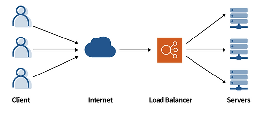
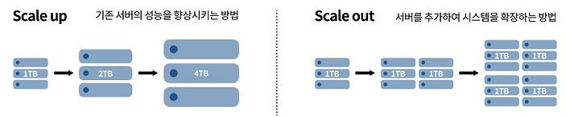

# 2023.12.18 - LoadBalancer

운용중인 애플리케이션의 사용자가 방대하거나 트래픽이 한꺼번에 몰리는 경우 서버가 다운되는 경우를 많이 보았다. (2022,2023 수강신청..)

트래픽을 안정적으로 분배할 수 있는 방법은 무엇이 있을까?

### 1. 로드밸런서

   

- 클라이언트와 서버 그룹사이에 위치해 서버에 가해지는 트래픽을 여러대의 서버에 고르게 분배하여 특정 서버의 부하를 덜어준다.

- 여러대의 서버에 고르게 분배한다.

###### 서버와 서버 사이의 데이터 동기화는 어떻게 해야할까?

### 2. 로드밸런서 두개의 방식

   

- 스케일 업 : 기존 서버의 향상시키는 방법, cpu 나 메모리를 업그레이드 하는것
- 스케일 다운 : 서버를 추가하여 시스템을 확장하는 것. 스케일 업보다 여러 서버에 부하가 분산되며, 장애 발생시 전면 장애 가능성이 적다.

### 3. 로드밸런싱 알고리즘(정적 로드 밸런싱: 현재 서버 상태를 고려하지 않는 고정된 규칙)
- 라운드 로빈 방식 : 클라이언트의 요청을 서버에 순차적으로 분배하는 방식 → 서버들이 동일한 스펙을 가지고 있고, 서버와의 연결시간이 오래 지속되지 않는경우 적합하다.
- 가중치 기반 라운드 로빈 방식 : 좋은 성능의 서버에 높은 가중치를 매겨 가중치 순으로 분배한다.
- ip 해시 방식 : 사용자의 Ip 주소를 숫자로 변환해 개별 서버에 매핑한다. → 사용자가 항상 동일한 서버에 연결된다.

### 4. 로드밸런싱 알고리즘(동적 로드 밸런싱: 현재 서버의 상태를 고려한 규칙)
- 최소연결방법 : 연결이 가장 적은 서버에 트래픽을 전송한다.
- 최소응답시간방법 : 서버의 연결상태와 응답시간을 고려해서 가장 짧은 응답시간을 보내는 서버로 트래픽을 할당한다.

aws 의 Elastic Load Balancing(ELB)를 사용하면 소프트웨어 로드밸런서를 사용할 수 있다. application, network, gateway, classic Load Balancer 로 4가지 로드밸런서를 설정할 수 있다.

