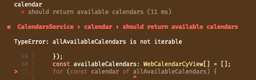

# 2023.11.07



**어떤에러인가요?**

: typeError , allAvailableCalendars is not iterable에러로, mdn web docs 에 따르면, for문 또는 구조파괴시 사용되는 변수의 타입이 iterable 하지 않을때 발생하는 에러이다.

JS에서 확인할 수 있는 Build-in iterable은 string, array, typed attay, map, set, iterable protocol 을 구현하는 객체 이다.

→ for 문에서 사용되는 allAvailableCalendars에서 난 에러이므로 allAvailableCalendars가 iterable 한 것인지를 살펴보아야겠다.

---

**왜 발생했나요?**

: allAailableCalendars의 값은 데이터베이스에서 불러온 값에 의해 결정되는데, 이때 불러오는 값이 배열일수도, undefined 일 수도 있다.

---

**어떻게 해결해볼 수 있을까요?**

for 문 로직 전 if else 문을 사용해서 undefined 일 경우 에러 처리를 해주고, 함수의 반환 값이 undefined 일 수 있음을 ts에 알려준다.

---
**또 다른 해결 법**

typeof로 확인해본 결과 allAvailableCalendars는 객체였다(->[{},{},{},]과 같은 형태였다). 객체는 iterable 한 타입이 아니기 때문에 for of 문을 사용할 수 없고, if 문과 함께 for in 문을 사용해 주어야 하는데,
만약 for of 문을 사용해야한다면 object.value(), object.key(), object.entries를 사용하면 된다.

###### for in 을 사용하는 방법
```typescript
for (const a in b) {
      if (Object.prototype.hasOwnProperty.call(b, a)) {
        const c = b[a];
```
###### Object.entries를 사용하는 방법
```typescript
for (a of Object.entries(b)
```
