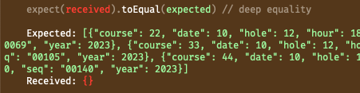

# error : 2023.11.13

## **어떤 에러인가요?**



특정날짜에 예약된 게임정보를 반환하는 테스트코드에서 테스트용으로 만든 메모리에 데이터가 들어가지 않는 문제

## **왜 발생했을까요?**

데이터를 넣는 코드가 실행되지 않았거나, 코드에 오류가 있어서 들어가지 않는것 같다.

## **어떻게 해결할 수 있을까요?**

데이터를 넣는 부분을 살펴보니, 테스트하는코드 (service 부분)이 실행되지 않고 있었다.

오류 메세지는 : Did you forgot write async in your code? 와 비슷한 문장이었는데, service부분을 실행하는 곳에 await 이 빠져있었다….

```jsx
const result = await service.somethingToTest(year, month, date);
```

