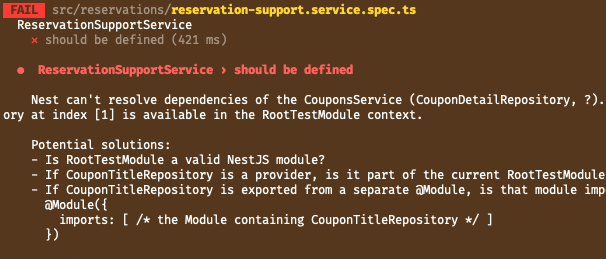
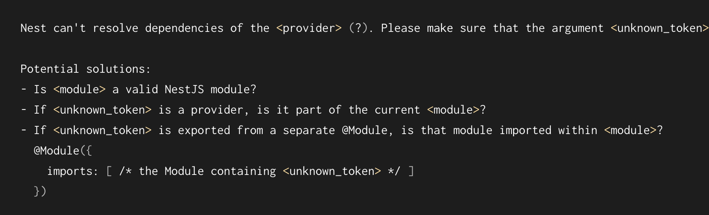

# 2023.12.11 - common errors

## **"cannot resolbe dependency" error**

이전에도 많이 만났던 에러인데, 의존성을 확인할 수 없다는 에러이다. 이번 에러의 경우에는 테스트 하려는 서비스 A를 위해 보조로 사용되는 B를 가져온뒤, B에서 사용되는 Repository 를 mock 해주지 않아서 나는 에러이다.

깃허브를 찾아보면, export, import, provider를 잘못 설정해두었거나, app.module, service.module 에서 필요한 요소를 중복으로 등록해둔 경우 위와 같은 에러가 발생한다고 한다.

---

nestjs의 공식문서 common errors에 나와있을정도로 많이 발생하는 에러인가보다. 아래는 공식문서에 정의되어있는 can’t resolve dependencies 에러에 대한 내용이다.

- provider 배열에 module 을 입력해두지 않은 경우.
- provider 가 featureModule 또는 root Module 에 중복되는 경우가 있는데, 이때에도 해당 오류가 발생할 수 있다.(중복 시도로 인해)
- 추가로, unknown_token 메세지가 함께 발생하는 경우에는 provide의 injection을 살펴봐야한다. (nestjs에서는 self-injection이 허용되지 않기 때문

