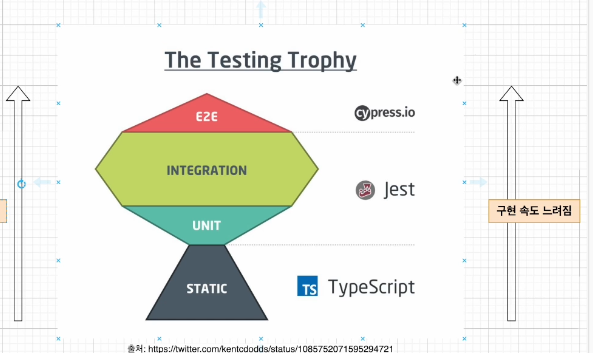
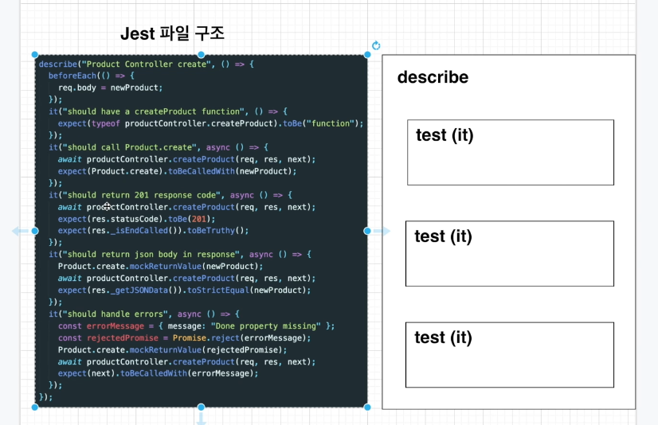
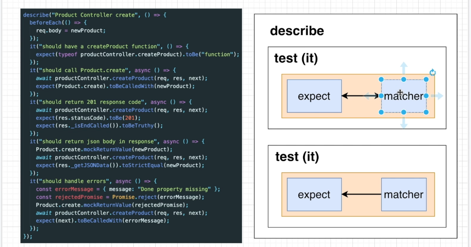

# 개념 : 유닛테스트, 통합테스트, e2e 테스트

- [ ] 유닛테스트 작성법을 먼저 공부해놓고, 테스트 코드 작성 후 보완하기



정적테스트 : 구문 오류, 스타일 검증(Eslint, typescript)

단위테스트 : 유닛테스트

### 유닛테스트

단위테스트란 : 개발자가 수행하고 자신이 개발한 코드의 단위(모듈, 구성요소) 를 테스트한다. 소스코드의 개별단위를 테스트하여 사용할 준비가 되었는지 확인하는 테스트방법. 메소드를 테스트하는 또다른 메소드

단위 테스트의 조건

1. 독립적이어야하며, 어떤 테스트도 다른 테스트에 의존하지 않아야 합니다.
2. 격리되어야한다. (데이터베이스등)의 오류가 테스트의 오류와 혼동되지 않도록 격리되어야합니다.

---

### 통합테스트

통합되어 제대로 **상호작용이** 되는지 테스트하는것.

의존성을 테스트한다.,

### e2e

end to end : 실제 사용자가 사용하는 것과 같은 조건에서 테스트를 진행하는 것을 말함.

qa팀에서 하는 것 처럼 테스트

---

jest 가 테스트 파일을 찾는 방법.

jest : test, spec, tests(촐더안에 있는 모든 파일 실행 → 통합테스트)



describe(name, fn) ⇒ 여러개의 테스트를 그룹화하는 블록

it(name, fn, timeout) ⇒ 개별 테스트를 수행하는 곳, 각 테스트를 작은 문장처럼 설명합니다.

ex) Describe(과일)

it 사과, it 바나나



expect : 값을 테스트할때마다 사용, matcher 와 함께 사용됩니다.

```tsx
test('two plus two is four', () => {
	expect(2+2).toBe(4);
});

.not.toBe(5);
```

### jest.fn() : 단위테스트가 의존적이지 않도록 하기 위해 사용하는 함수

mock함수를 생성하는 함수 입니다.

모의, 가짜, 흉내내는

단위테스트를 작성할때, 해당코드가 의존하는 부분을 가짜로 대체하는 일을 해줍니다.

예를 들어서…

테이터베이스에서 데이터를 저장하는 부분 → 데이터 베이스가 잠시 죽어있으면 테스트 결과에도 영향을 미치게 된다.

### mock 함수의 결과값을 어떤 결과값을 return 할지 직접 알려주기

```tsx
mockFunction.mockReturnValue("가짜 함수 반환");
console.log(mockFunction); // 가짜 함수 반환
```

### 가짜 함수가 몇번 호출되었고 어떤 인자가 넘어왔는지 검증

```tsx
mockFunction("hello");
mockFunction();
expect(mockFunction).toBeCalledWith("hello");
expect(mockFunction).toBeCalledTimes(2);
```

### jest.spyOn()

: 어떠한 정보를 몰래 빼낼 때 사용합니다.

해당 함수의 호출 여부와 어떻게 호출되었는지를 알 수 있습니다.

실제함수를 호출할때 사용.

### nest에서 테스트 하기

npm run test

